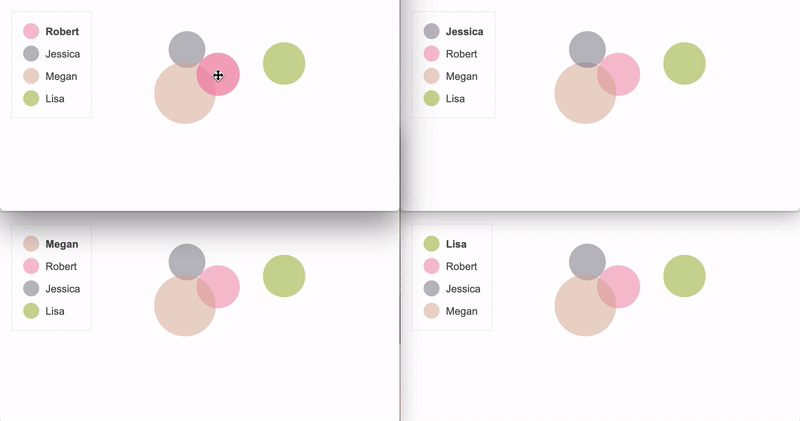

# NodeJS WebSockets

### Play with friends by moving colorful circles around real-time :)

### How to Install

1. [Download](https://nodejs.org/en/download/) and install NodeJS

2. In terminal locate directory with app and run: `npm install websocket`

3. Run: `node app.js`

4. Finally open index.html

App will run on localhost with 8080 port. Feel free to edit port number.

Each time you open new tab with index.html you'll add new user to the app. Each user can control their own circle and others will see changes immediately

