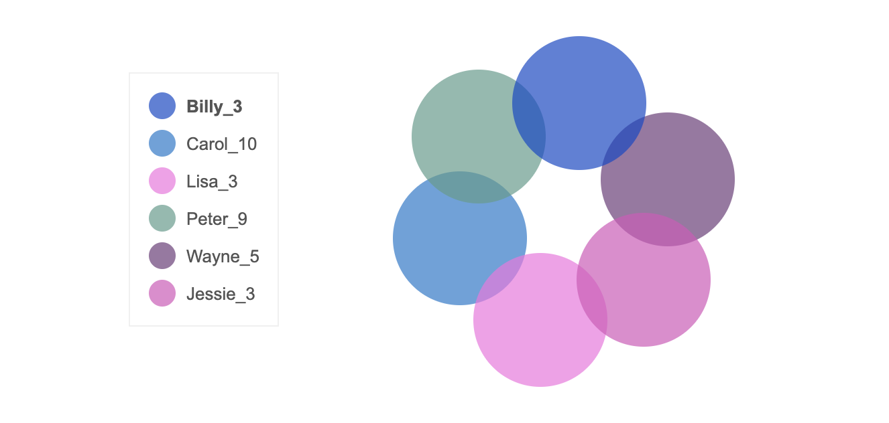

# NodeJS WebSockets

### Play with friends by moving colorful circles around real-time :)

### How to Install

`1. [Download](https://nodejs.org/en/download/) and install NodeJS`

`2. In terminal locate directory with app and run: npm install websocket`

`3. Finally run: node app.js`

